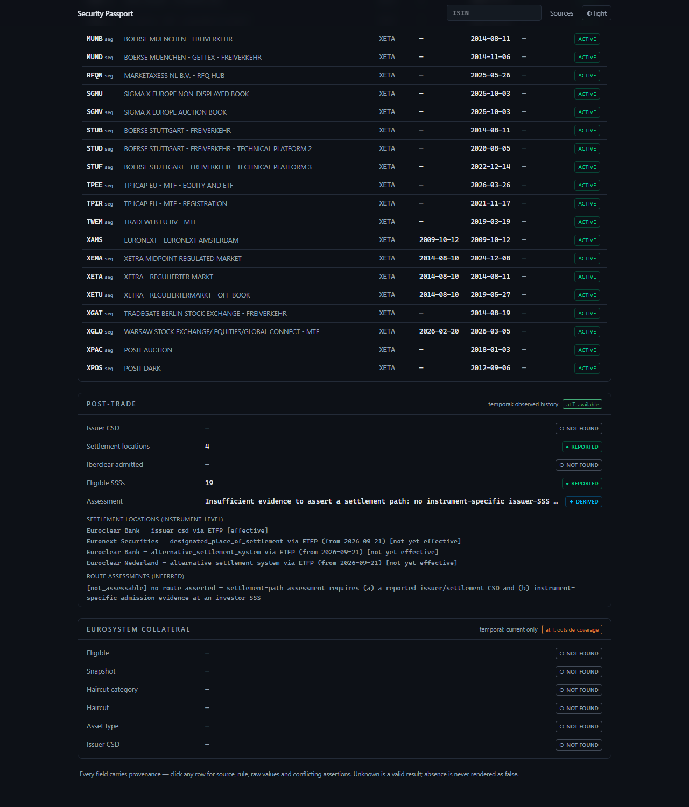

# Security Passport

[](https://github.com/Huntsman1756/security-passport/actions/workflows/ci.yml)
[](https://github.com/Huntsman1756/security-passport/releases)
[](LICENSE)
[](pyproject.toml)

**An evidence-backed operational passport for European financial
instruments.**

Live demo: <https://passport.h1756.es> (replays a captured corpus
of 28 instruments through the production parsers) ·
API docs: <https://passport.h1756.es/api/docs> ·
Latest release: [`v0.2.1`](https://github.com/Huntsman1756/security-passport/releases) ·
Status: research-grade / pre-1.0

> Security Passport turns an ISIN into an evidence-backed
> operational record by joining European securities reference data,
> prospectus disclosures, trading-venue admissions,
> settlement-infrastructure evidence and Eurosystem collateral
> data.
>
> Every reported, derived or inferred field carries provenance.
> **Unknown is a valid result.**

```console
$ security-passport DE000A3LJCB4

SECURITY PASSPORT
────────────────────────────────────────

IDENTITY
ISIN            DE000A3LJCB4
CFI             DBFUGB                       reported
Issuer LEI      894500SN5GTABFSFWS54         reported · corroborated
...
```



*The document was already known on 19 Sep 2026; the designated
settlement location does not become effective until 21 Sep 2026.*

## What it does

Given one ISIN it answers, with per-field provenance:

- **IDENTITY** — what the instrument is: CFI, FISN, name, issuer
  LEI (with preserved conflicts), currency, relevant entities.
- **PRIMARY MARKET** — which legal documents support the issuance:
  prospectus / base prospectus / final terms / supplements,
  approval authority, home and passporting states.
- **SECONDARY MARKET** — where it is admitted to trading, at
  ISIN×MIC granularity, with admission/termination state.
- **POST-TRADE** — four separate claims, never merged:
  - **issuer CSD/SSS** — where directly reported (ECB collateral
    reference);
  - **settlement locations** — instrument-level admission
    evidence, potentially multiple per ISIN, with
    `source_published_at` ≠ `effective_from`;
  - **link topology** — CSD↔CSD infrastructure relationships,
    never treated as instrument routes;
  - **route assessments** — evidence-bounded deterministic
    assessments with explicit limitations.
- **EUROSYSTEM COLLATERAL** — whether the asset is on the ECB
  eligible list, its haircut category and inputs, and the snapshot
  that claim comes from.

## What it does not do

- No prices, no portfolios, no watchlists, no alerts, no
  authentication, no LLM chat.
- It does not route settlement: a link between two SSSs does not
  prove an ISIN can settle across it, and the product says so.
- It does not turn `not_found` into `false`.
- It does not resolve provider conflicts silently — disagreement is
  a displayed state.

## Evidence model

Every field is one of:

| status | requires |
|---|---|
| `reported` | ≥1 evidence reference (provider, dataset, record/document, artifact/locator, timestamps, raw value) |
| `derived` | evidence + versioned rule |
| `inferred` | evidence + rule + explanation + limitations |
| `conflict` | ≥2 incompatible assertions |
| `not_found` | named searched sources |
| `not_applicable` | a rule explaining why |

Source-quality problems ride alongside as `quality_flags` —
never as fake statuses. There are no confidence probabilities.

Release gate: `unsupported_assertions = 0`.

## Data sources

| source | used for |
|---|---|
| OpenInstrument (ESMA FIRDS + GLEIF projection) | identity, venue listings, issuer assertions, identifiers, publication history |
| ESMA Prospectus Register (PRIII) | prospectus document graph, approval/passporting |
| ECB eligible marketable assets | collateral eligibility, haircut inputs, reported issuer CSD |
| ECB eligible SSSs / eligible links | settlement-system topology |
| ISO 10383 MIC list | venue naming |
| OpenVenue | venue/operator context + captured rulebook references |
| Euronext Securities Milan / France | instrument-level settlement-location evidence |
| cnmv_iic (OpenFunds) | Spanish fund/share-class/manager/depositary roles |
| Iberclear public documentation | SSS identity only (no instrument claims) |

Attribution and reuse basis per source: `docs/legal/`.

Security Passport transforms and combines public source
information; it is not endorsed by ESMA, the ECB, GLEIF, ISO/SWIFT
or BME/Iberclear.

## Quickstart

```console
git clone https://github.com/Huntsman1756/security-passport.git
cd security-passport
make setup                     # python deps + web deps
security-passport doctor       # verify environment
security-passport DE000A3LJCB4 # fixture mode works offline
make dev-api                   # http://127.0.0.1:8000
make dev-web                   # http://127.0.0.1:5173
```

Fixture mode (`SECURITY_PASSPORT_PROVIDER=fixtures`) serves a
captured corpus of real responses — no datasets required.

Production mode points at an OpenInstrument API:

```
SECURITY_PASSPORT_PROVIDER=openinstrument_api
OPENINSTRUMENT_URL=http://openinstrument:8000
security-passport update       # ingest own sources → publish generation
```

## API

```
GET /api/v1/passports/{isin}
GET /api/v1/passports/{isin}/evidence
GET /api/v1/passports/{isin}/sources
GET /api/v1/search?q=
GET /api/v1/status          # includes the demo corpus in fixture mode
GET /health/live   /health/ready
GET /api/docs               # interactive OpenAPI
```

Partial passports return `200` with per-block `not_found`; a
fallen source degrades its fields, never invents them.

## Architecture

```
providers (OI REST, ESMA PRIII, ECB, ISO MIC)
      │
immutable evidence (raw bytes + sha256 + locators)
      │
normalized assertions (per provider, verbatim + raw preserved)
      │
deterministic adjudication (conflicts preserved)
      │
passport projection — assembled per request, pinned to
(passport generation, upstream generation)
      │
CLI / REST / web
```

Own-source stores publish through generations
(`build → validate → CURRENT` atomically); a failed update never
moves the pointer.

## Temporal honesty — `--as-of`

Each block declares its temporal basis (`native_history`,
`reconstructed`, `observed_history`, `current_only`) and an
`answer_state` (`available`, `partial`, `outside_coverage`,
`unavailable`) when queried at a date. `as_of(T)` selects
admissible evidence at T first, then re-runs adjudication — it
never filters a current passport afterwards.

> `--as-of` is evidence-aware, not omniscient. Each block answers
> according to its declared temporal basis; unavailable
> historical evidence is never replaced with current knowledge.

```console
$ security-passport IE00B4L5Y983 --as-of 2026-09-19
# Milan file published 09-18 → designated settlement location
# known but NOT yet effective (effective_from 09-21)

$ security-passport IE00B4L5Y983 --as-of 2026-09-21
# same evidence set → designation now effective
```

See `docs/adr/ADR-005-temporal-semantics.md`.

## QA

- `make check` — ruff, mypy strict, pytest, frontend build
- golden corpus (`tests/fixtures/goldens.yaml`) +
  `security-passport validate`
- determinism: two rebuilds must produce the same semantic
  fingerprint
- no network in tests by default (`-m live` opt-in)

## License

Code: MIT. Data: per-source — see `docs/legal/source-reuse.md`.
